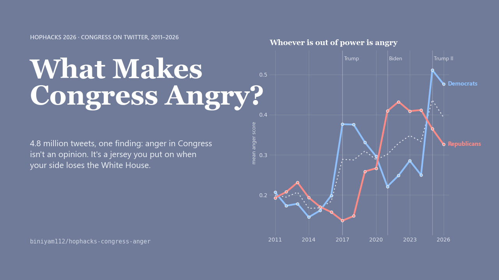

# What's making US angry?

**4.8 million tweets by 902 members of Congress, 2011 to 2026, each scored for anger.**
A field guide to what actually predicts political anger: the presidency, the clock, the person, and the medium.

[**Read the story**](https://biniyam112.github.io/hophacks-congress-anger/) · HopHacks 2026

> Anger in Congress isn't an opinion. It's a jersey you put on when your side loses the White House.



## What we found

| | Finding |
|---|---|
| **The out-party is the angry one** | Both parties were equally calm under Obama (0.18 vs 0.19). Since 2017 whichever party lost the White House is the angry one, and the lines cross at every inauguration. Each hand-over leaves the floor higher: today's in-party (0.35) is angrier than 2017's out-party (0.34). |
| **Congress angers Congress** | Four of the five biggest weekly spikes are government shutdowns. Of the 40 biggest, 13 are fiscal brinkmanship, about 10 are presidential actions, and 6 are violence or tragedy, the only weeks when the two party lines converge. |
| **Anger keeps office hours** | Working hours sit on the yearly average. 9 pm to 4 am is angrier in 13 of 16 years. August recess is calmer in 14 of 16. In 6 of 7 elections the final four weeks are calmer than the rest of the year. |
| **You can forecast it** | 29% of tweets are angry. Knowing the party tells you nothing; knowing the party and the president moves it to 52%; knowing the person makes it near certain (one senator, 9 to 5, in 2025: 90%). Volume predicts anger too, Spearman 0.31. |
| **Nobody unites from opposition** | Polarizing tweets belong to the out-party (35% of Democratic tweets in 2025, a record); civic unity belongs to the in-party. The parties' emotional profiles were closest in 2020 and have been far apart since 2021. |
| **The medium is the mood** | Only 2% of member-to-member retweets cross the aisle, and they are the calmest tweets in the data (0.16). 37% of `.@` call-outs cross the aisle, and they are the angriest (0.61), nearly all aimed at party leaders. |

## Contents

| Path | What it is |
|---|---|
| `site/` | The web story: six chapters plus two animated interludes ([a day on the Hill](https://biniyam112.github.io/hophacks-congress-anger/timelapse.html), [the parties' distance as a romance](https://biniyam112.github.io/hophacks-congress-anger/romance.html)). Static HTML, CSS and Plotly, no build step. Deployed to GitHub Pages on every push. |
| `marimo/` | The interactive [marimo](https://marimo.io) notebook for the DSAI x marimo track: every chart reactive, the anger forecast as a live function, a custom `anywidget`. See [`marimo/README.md`](marimo/README.md). |
| `deck/` | Generators for the 13-slide presentation (`build_deck.js`) and the 90-second animated explainer (`make_video.py`). |
| `results/`, `figures/` | Aggregated CSVs and static charts produced by the pipeline. |
| `score_text.py` | Score any text with the same models the project uses. |

## The pipeline

```bash
pip install -r requirements.txt
python run_pipeline.py          # everything; add --skip-labels to re-run only the analyses
python export_site_data.py      # refresh the JSON the site and notebook read
```

`run_pipeline.py` runs, in order:

1. `build_author_ages.py` matches 1,156 Twitter handles to bioguide IDs, birthdays and terms (handles first, including 14 yearly snapshots of the social-media file so former members are covered, then name plus state as a fallback).
2. `build_tweets_enriched.py` keeps in-office tweets and adds age at tweet, local hour, month and position in the election cycle.
3. `label_emotions.py` scores all 4.97M tweets with two RoBERTa models. Resumable in 50k chunks. About two hours on a laptop RTX 4050, roughly a day on CPU.
4. `analyze_time.py`, `analyze_age.py`, `analyze_seismograph.py`, `analyze_forecast.py`, `analyze_unity.py`, `analyze_network.py` write `results/*.csv`.
5. `export_site_data.py` and `export_romance_tweets.py` write the small JSON files the site and notebook read.

## Scoring your own text

```bash
python score_text.py "It's downright criminal. They're slashing Medicare to cut taxes for billionaires."
```

```
  ANGRY  (anger 0.98, threshold 0.5)
  emotions:  anger 0.98  disgust 0.92  sadness 0.15
  sentiment: negative 0.93  neutral 0.05  positive 0.02
```

Also takes `--file` (one text per line), stdin, and `--json`. Importable as `from score_text import score, score_many`.

## Data and method

- **Tweets**: the HopHacks `congress-tweets-unified.parquet` (5.1M rows, not committed, 420 MB). We keep tweets by members of the House and Senate sent while in office from 2011 onward: 4.83M tweets by 902 members. Executive-branch accounts, pre-election personal tweets and a few corrupt pre-2011 rows are dropped.
- **Members**: the open [`unitedstates/congress-legislators`](https://github.com/unitedstates/congress-legislators) dataset for birthdays, terms and handles. 100% of members matched.
- **Scores**: [`cardiffnlp/twitter-roberta-base-emotion-multilabel-latest`](https://huggingface.co/cardiffnlp/twitter-roberta-base-emotion-multilabel-latest) gives 11 independent emotion probabilities; [`cardiffnlp/twitter-roberta-base-sentiment-latest`](https://huggingface.co/cardiffnlp/twitter-roberta-base-sentiment-latest) gives negative, neutral and positive. **Mean anger** is the average probability; a tweet is **angry** when P(anger) > 0.5.
- **Comparisons**: hour, month and age effects are computed within a single year and shown as deviation from that year's mean, so the steep 2011 to 2026 trend cannot masquerade as a daily or seasonal pattern. Election cycles are always shown separately, never pooled.
- **Limits**: scores are model estimates, spot-checked by hand. Hours use each member's home-state clock, which is wrong whenever they are in Washington. The 2023 to 2024 part of the collection contains almost no retweets, so the retweet network excludes those years. We see explicit public call-outs only, not replies or quote tweets.

The full method note is the appendix of the [web story](https://biniyam112.github.io/hophacks-congress-anger/#methods).

## License

Code is MIT. The tweet dataset belongs to its publisher; member data from `unitedstates/congress-legislators` is public domain.
